<p align="center">
  <a href="https://www.grupotracker.com.br" target="blank"></a>
</p>

# CRM Simplificado - Teste Técnico Fullstack

Este projeto é um sistema CRM simples com autenticação, controle de usuários, cadastro de clientes (customers) e registro de atendimentos. Faz parte de um teste técnico para a vaga de Desenvolvedor(a) Fullstack Pleno.

---

## 📚 Tecnologias Utilizadas

### Backend

-   [NestJS](https://nestjs.com/)
-   [Prisma ORM](https://www.prisma.io/)
-   [JWT](https://jwt.io/)

### Frontend

-   [Next.js](https://nextjs.org/)
-   [React](https://reactjs.org/)

### Banco de dados

- SQLite (Banco relacional com foco em entrega de MVP)

---

## 🧱 Estrutura do Projeto

O projeto está dividido em duas pastas principais:

-   `frontend/` – Aplicação web construída com **Next.js** e **React**.
-   `backend/` – API REST construída com **NestJS** e **Prisma ORM**.

---

## 🔐 Autenticação e Autorização

-   Autenticação baseada em JWT.
-   Rotas protegidas com `AuthGuard`, exceto a rota de login e a de cadastro de usuários no sistema.
-   A Criação de clientes é protegida por roles: apenas usuários com `SELLER` ou `ADMINISTRATOR` podem acessar.

---

## 👥 Perfis de Usuário (Roles)

Os usuários são divididos em três perfis, definidos pelo enum:

```ts
enum Role {
  ATTENDANT
  SELLER
  ADMINISTRATOR
}
```

Diagrama de classes:

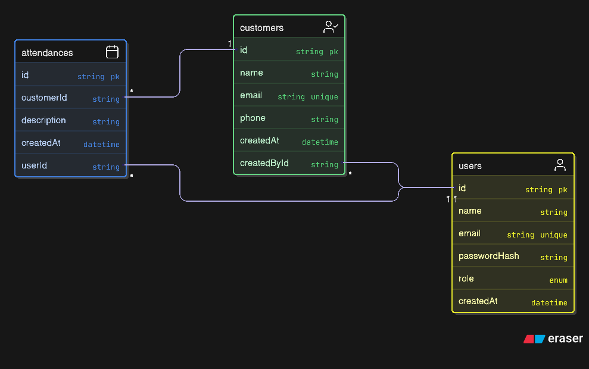

---

## 👤 Usuários de Teste (Seed Inicial)

O banco de dados já vem com três usuários pré-cadastrados, um para cada role:

| Nome      | Email                    | Senha  | Role          |
| --------- | ------------------------ | ------ | ------------- |
| Admin     | admin@crmtracker.com     | 123456 | ADMINISTRATOR |
| Atendente | atentende@crmtracker.com | 123456 | ATTENDANT     |
| Vendedor  | vendedor@crmtracker.com  | 123456 | SELLER        |

---

## 📦 Frontend – Estrutura de Pastas

Dentro de `frontend/src`, a estrutura segue este padrão:

-   `/components` - Diretório dos componentes da aplicação
-   `/elements` - Diretório dos elementos da aplicação
-   `/helpers` – Classes estáticas que auxiliam tarefas no frontend, como requisições e armazenagem de informações no browser.
-   `/model` – Diretório das representações das entidades no front.
    -   `/dto` – Objetos de transferência de dados (Data Transfer Objects).
-   `/pages` - Rotas da aplicação.
-   `/services` - Classes que aplicam regras de negócio atreladas as entidades

---

## 📦 Backend – Estrutura de Pastas

Dentro de `backend/src/`, a estrutura segue este padrão:

-   `/controller` – Controllers REST.
-   `/service` – Lógica de negócios.
-   `/module` – Módulos do NestJS.
-   `/model`
    -   `/dto` – Objetos de transferência de dados (Data Transfer Objects).

---

## 📋 Funcionalidades

-   **Autenticação** com JWT
-   **Criação e login de usuários**
-   **Controle de permissões por role**
-   **Cadastro de clientes (customers)** – restrito a SELLER e ADMINISTRATOR
-   **Registro de atendimentos** – permitido para todos os usuários
-   **Histórico de atendimentos vinculado ao cliente**
-   **Formulário de cadastro de usuários acessível pela tela de login**
-   **Campo de pesquisa de clientes pelo nome ou e-mail**

---

## 🚀 Como Rodar o Projeto

### Pré-requisitos

-   Node.js 18+
-   Npm

### 1. Clonar o repositório

```bash
git clone https://github.com/leandroteixeira97/teste-tracker.git
cd teste-tracker
```

### 2. Instalar dependências

**Backend**:

```bash
# a partir da raiz do repositório
cd backend # para entrar na pasta do backend
npm install # para instalar as dependências do backend
```

**Frontend**:

```bash
# a partir da raiz do repositório
cd frontend # para entrar na pasta do frontend
npm install # para instalar as dependências do frontend
```

### 3. Configurar variáveis de ambiente

O repositório já virá com as variáveis configuradas para rodar o projeto localmente.

### 4. Rodar as migrações e seed

```bash
# a partir da raiz do repositório
cd backend
npx prisma generate
npx prisma migrate dev --name init
npx prisma db seed
```

### 5. Iniciar o servidor

Abra dois bashs, onde um será responsável por rodar o `backend` e o outro, o `frontend`

```bash
# No bash dedicado ao backend
cd backend
npm run start:dev
```

```bash
# No bash dedicado ao frontend
cd frontend
npm run dev
```

### 6. Acessar a aplicação

Em seu navegador, coloque a url http://localhost:4000 para acessar a aplicação:

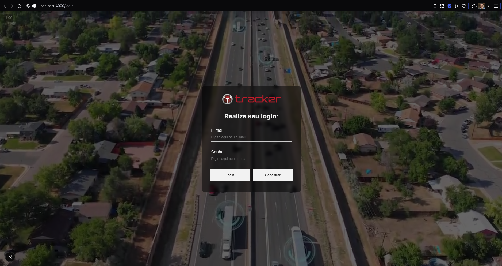

### 7. Rotas da aplicação

#### Rota de autenticação - `/login`


#### Rota da página inicial - `/home` - Botões visíveis para os acessos de Administrador e Vendedor

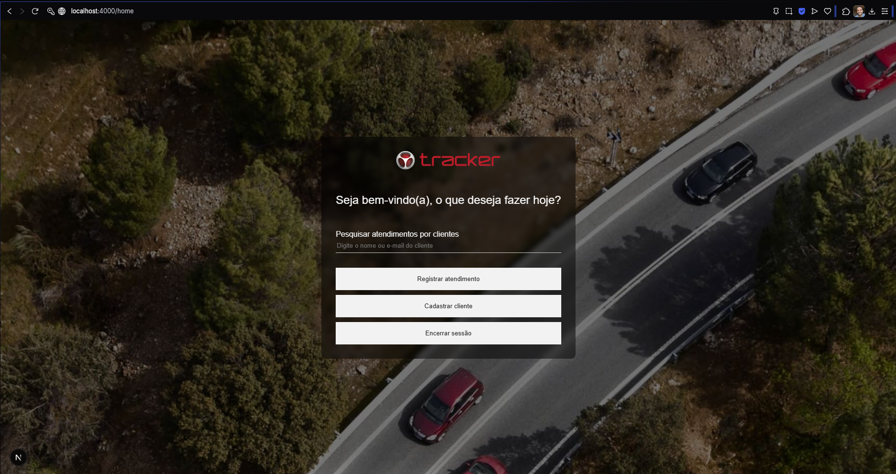

Botão de `cadastrar cliente` oculto para o acesso de Atendente:

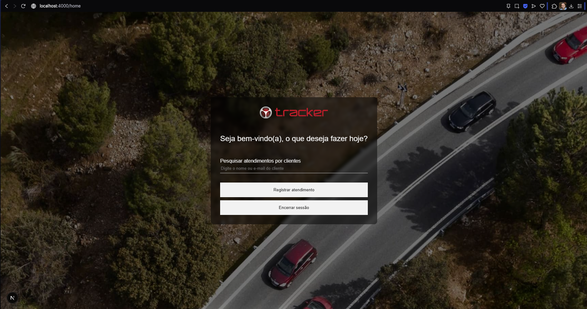

#### Rota de cadastro de clientes - `/customers/new` - Restritos aos acessos de Administrador e Vendedor

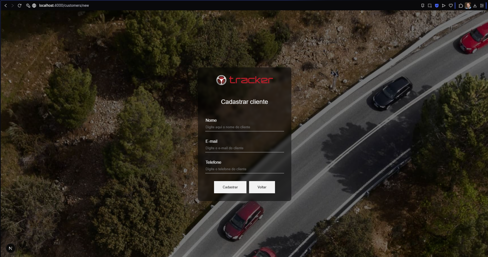

Quando logado como atendente, e se o usuário colocar na barra de endereços a rota `/customers/new`, a rota informará que o usuário não possui acesso à esta funcionalidade:

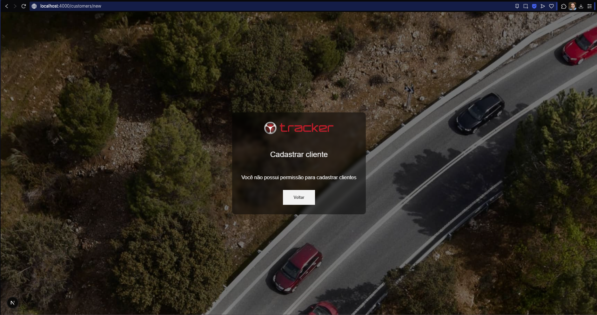

#### Rota de cadastro de atendimento - `/attendances/new`

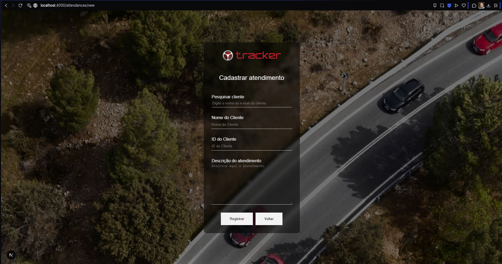

Componente de pesquisa de cliente:

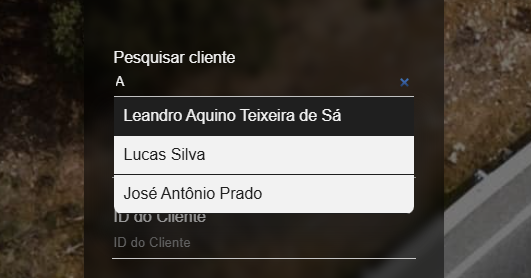

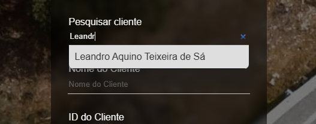

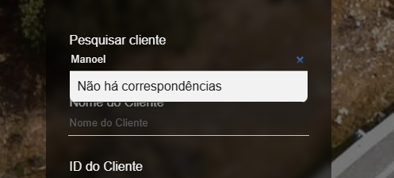

Ao clicar em um cliente, suas informações são preenchidas no formulário de atendimento:
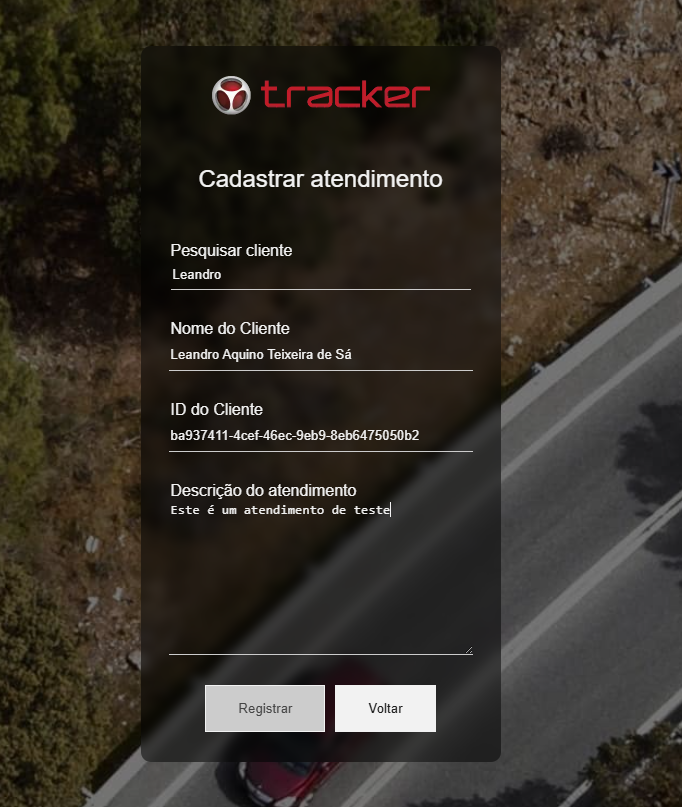

#### Rota de pesquisa de atendimentos - `/attendances/history/{id-cliente}`
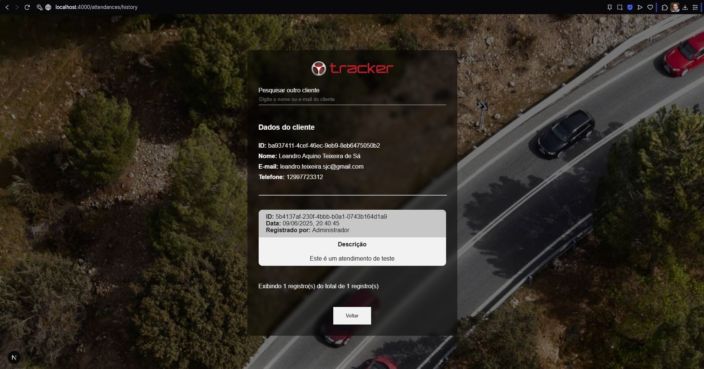

---

## 📩 Contato

Caso tenha dúvidas ou sugestões, fique à vontade para entrar em contato.

---
